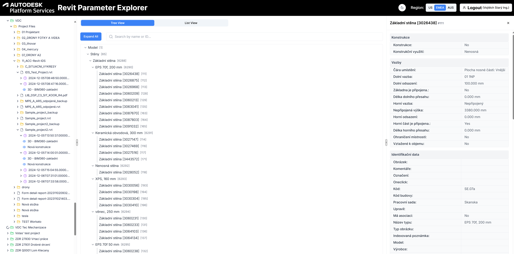

# Revit Parameter Explorer

A web application for browsing and viewing Revit model parameters through Autodesk Platform Services (APS).

## Overview

This application connects to your Autodesk account and allows you to browse through Construction Cloud projects, navigate model hierarchies, and explore detailed Revit parameter information. It provides a convenient way to access and visualize Revit model data without needing to open the model in Revit.



## Features

- **Authentication** with Autodesk Platform Services
- **Dark/Light mode** theme switching
- **Server region selection** (US, EMEA, AUS)
- **Project hierarchy navigation** for Autodesk Construction Cloud projects
- **Dual panel view** with object tree and properties list
- **Resizable panels** for customized viewing experience
- **Responsive design** that works on desktop and mobile devices

## Getting Started

### Prerequisites

- Node.js 18 or later
- npm or yarn
- Autodesk Developer account with APS credentials

### Environment Setup

Create a `.env` file in the root directory with the following variables:

```
APS_CLIENT_ID=your_client_id
APS_CLIENT_SECRET=your_client_secret
APS_CALLBACK_URL=http://localhost:3000/api/auth/callback
```

### Installation

1. Clone the repository
```bash
git clone https://github.com/yourusername/revit-parameter-explorer.git
cd revit-parameter-explorer
```

2. Install dependencies
```bash
npm install
```

3. Start the development server
```bash
npm run dev
```

4. Open [http://localhost:3000](http://localhost:3000) in your browser

## Building for Production

```bash
npm run build
npm start
```

## Project Structure

```
├── app/                   # Next.js App Router components
│   ├── api/               # API routes for authentication and data fetching
│   ├── components/        # Application-specific components
│   └── page.tsx           # Main application page
├── components/            # Shared UI components
│   └── ui/                # UI components (buttons, cards, etc.)
├── lib/                   # Utility functions and services
│   ├── client/            # Client-side utilities
│   ├── server/            # Server-side utilities
│   └── services/          # API service integrations
├── public/                # Static assets
└── types/                 # TypeScript type definitions
```

## Technologies Used

- **Next.js 15** - React framework with App Router
- **TypeScript** - Type-safe JavaScript
- **Tailwind CSS** - Utility-first CSS framework
- **Autodesk Platform Services SDK** - For accessing Autodesk APIs
- **shadcn/ui** - Customizable UI component library

## Authentication Flow

1. User clicks the login button
2. User is redirected to Autodesk login page
3. After successful authentication, user is redirected back with an authorization code
4. The application exchanges the code for access tokens
5. The tokens are stored in cookies and used for subsequent API calls

## License

This project is licensed under the MIT License - see the [LICENSE](LICENSE) file for details.

## Acknowledgments

- Autodesk Platform Services for providing the APIs
- The Next.js team for the excellent React framework